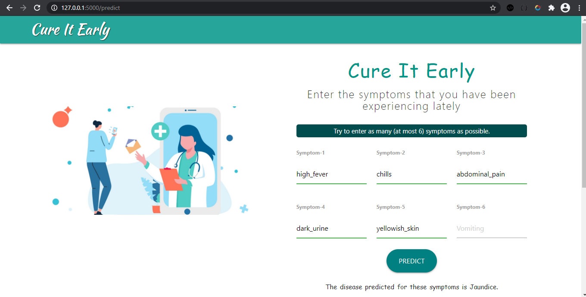
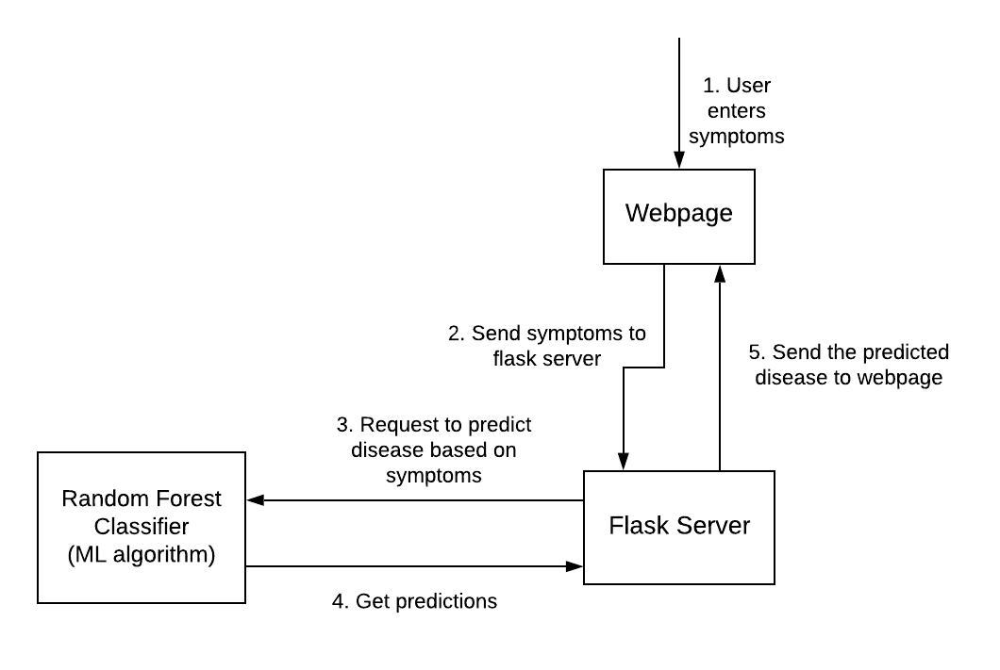

# CureItEarly---Disease-Predictor

## Description
CureItEarly - A Disease Predictor, takes the symptoms experienced by the user as input and predicts the disease using Random Forest Classifier Algorithm. 
The predictor is tested to be accurate as well as efficient. This web-application could be fruitful in saving time as well as in case of emergencies.

*Being in initial phase, it should not be considered as an alternative for the prevailing medicinal practices and assessments. 
So, it is recommended that proper consultancy must be done by the user with a professional before consuming medicines based on disease predicted by our application.*

## Screenshots

## Tech Stack 💻
- [Flask](https://flask.palletsprojects.com/en/1.1.x/) - Web application framework written in Python.
- [Jinja](https://jinja.palletsprojects.com/en/2.11.x/) - Modern day templating language for Python developers.

## Algorithm used
Random Forest Classification Algorithm has been used to train and test the model.

Random Forest is a well-known algorithm to train early in the model development
process, to see how it performs and is very simple to build. In addition to simplicity,
it provides a fairly sensible indicator of the importance it assigns to our options.
Random forests functions by building a multitude of decision trees at training time
and giving the class that is either the mean prediction (regression) of the individual
trees or mode of the categories (classification) as output.

The benefit of Random forest is that it is one of the extremely accurate classifiers. As
several decision trees are involved in the process, it is robust. There is no overfitting
problem as average of all the predictions is taken. It also handles values that are
missing.

**The model gives us an accuracy around ~97%.**

## Project Workflow

## Future Scope

- More functionalities can be added to improve
the experience of the user. Some of these are - enabling nearest hospital searching through API, integrating information into patient’s personalized profile so that
patient is able to see their saved results at a later time.
- On a large scale, this could be expanded into a personalized healthcare plan exclusively crafted for an individual.

## Developed By

- [Swatik Paul](https://github.com/swatikpl44)

